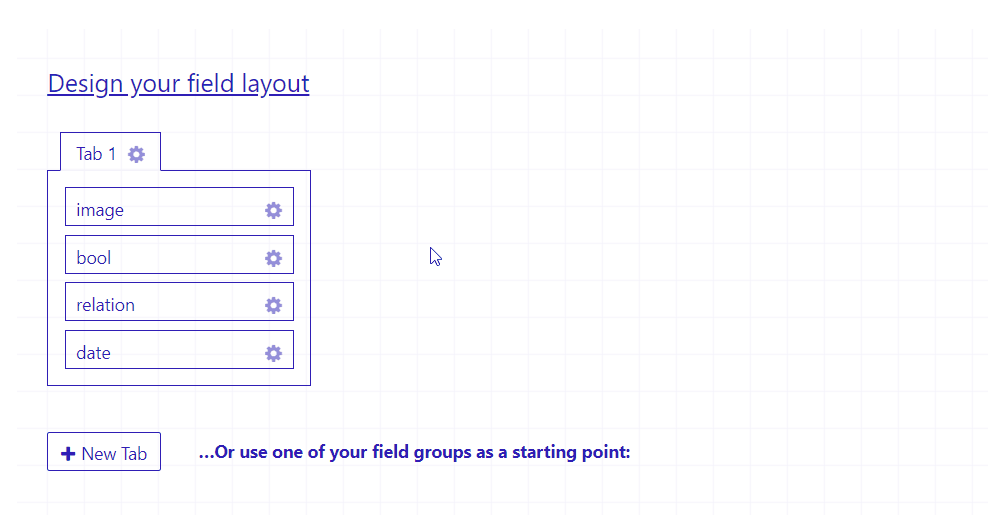

# Relabel Plugin for Craft CMS 3.x


## Requirements

This plugin requires Craft CMS 3.0.0 or later. **Important**: if you are coming from Craft 2 - there is no migration 
currently so all your Relabels will be deleted. If you really need a migration feel free to contact me or backup the table
and insert it on your own

## Installation

To install the plugin, follow these instructions.

1. Open your terminal and go to your Craft project:

        cd /path/to/project

2. Then tell Composer to load the plugin:

        composer require anubarak/craft-relabel

3. In the Control Panel, go to Settings → Plugins and click the “Install” button for Relabel .

## Basic Hints

Relabel creates a custom Database table that stores the new labels. Default Craft fields are not touched in any way.
The strings are replaced by JavaScript so you can remove/uninstall the plugin whenever you want without breaking changes in your Control Panel.
Relabel is compatible with the Craft 3 project config so you only need to relabel your fields in your main environment and can
sync all data.

## Usage

Go to your field layout, click on the wheel icon and select "Relabel"



Your field layout will have a different label and description.

To receive error messages that contains your new relabel strings do

```php
$errors = Relabel::getErrors($element);
```

Or in Twig
```twig

```

## Register Relabel for custom element types

There is an event to register Relabel for a custom form, 

```PHP
use anubarak\relabel\services\RelabelService;

Event::on(
    RelabelService::class,
    RelabelService::EVENT_REGISTER_LABELS,
    function(RegisterLabelEvent $event) use($myCustomElement){
        $event->fieldLayoutId = $myCustomElement->fieldLayoutId;
    }
);
```

## Register additional Relabels

You can as well register additional Labels for every field layout within your Plugins `init` function as well. Important: you need
to have the event there and not in certain Controllers because I need to pass those variables before the Controller action begins otherwise I'm not able to inject 
the required JavaScript to the request. This is an example how you could register custom nested field layouts

```php
Event::on(
    RelabelService::class,
    RelabelService::EVENT_REGISTER_ADDITIONAL_LABELS,
    function(Event $event) {
        $layoutId = $event->fieldLayoutId;
        $fields = Craft::$app->getFields()->getFieldsByLayoutId($layoutId);
        $plugin = Craft::$app->getPlugins()->getPlugin('relabel');
        /** @var RelabelService $service */
        $service = $plugin->get('relabel');

        foreach ($fields as $field){
            if($field instanceof Field){
                $blocks = $field->getBlockTypes();
                foreach ($blocks as $block){
                    $layoutForBlock = (int)$block->fieldLayoutId;
                    $index = $field->handle . '.' . $block->handle;
                    $relabels = $service->getAllLabelsForLayout($layoutForBlock, $index);
                    foreach ($relabels as $relabel){
                        $event->labels[] = $relabel;
                    }
                }
            }
        }
    }
);
```

If Relabel does not support your HTML yet, feel free to contact me and we'll find a way to make it work

## Currently supported Element Types are
- craft\elements\Entries
- craft\elements\Assets
- craft\elements\GlobalSets
- craft\elements\Categories
- craft\elements\Users
- verbb\voucher\elements\Voucher
- verbb\voucher\elements\Code
- craft\commerce\elements\Order
- craft\commerce\elements\Product
- craft\commerce\elements\Variant
- Solspace\Calendar\elements\Calendar

## Register custom labels after Ajax requests

Crafts entries are able to change the field layout by changing the entry type, if you want to be able to change the field layout for a custom element type via Javascript as well you need to include these lines

```PHP
$labelsForLayout = Relabel::getService()->getAllLabelsForLayout($layout->id);
Craft::$app->getView()->registerJs('Craft.relabel.changeEntryType(' . json_encode($labelsForLayout) . ');');
```
